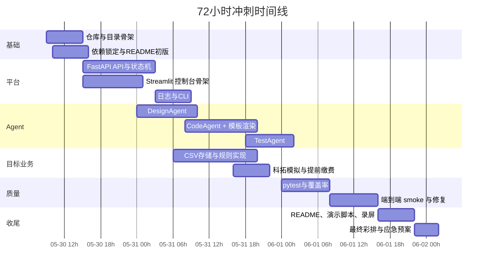

# AI Agent 自动开发流水线开发方案

## 执行摘要

在“无特定模型可用性、无既定云基础设施限制”的前提下，这个黑客松最稳妥的落地方式，不是做一个完全自由生成的“万能写代码 Agent”，而是做一个**模板优先、LLM 增强、可重试、可验收的本地单机流水线**：用一个轻量 Orchestrator 串起 DesignAgent → CodeAgent → TestAgent；前端用 Streamlit 做上传、状态与日志可视化；后端用 FastAPI 暴露最少量 API；所有批次状态、日志与产物严格落盘到比赛要求的目录与 JSON 文件中。这样既符合赛题对多 Agent、结构化传递、状态管理、失败节点单独重试、README 与演示验证的要求，也最容易在 48–72 小时内做出稳定 Demo。fileciteturn0file0

这条路线还与测试案例本身高度匹配。员工临时车辆预约程序的业务边界清晰，核心是园区配置、配额控制、预约申请、取消、提前缴费、科拓系统模拟与 CSV 存储；它非常适合用“结构化设计文档 + 项目模板 + 规则校验 + 自动化测试”的方式生成，而不适合把所有逻辑一次性塞进一个大 Prompt 里。题目也明确要求 Agent 之间以 Markdown/JSON 等结构化文档传递上下文，而不是直接把代码塞进 Prompt 完成全部任务。fileciteturn0file0 fileciteturn0file1

因此，我的核心建议只有三条。第一，**架构上采用 FastAPI + Streamlit + 本地文件系统**；第二，**生成策略上采用“设计先行、模板兜底、LLM 补全、自动修复”**；第三，**团队分工上把最多时间投到可运行链路、重试机制、测试覆盖和演示验证**，因为赛题评分中功能完整性、系统架构设计、系统验证三项合计占比最高。fileciteturn0file0

| 决策项       | 建议                                                |
| ------------ | --------------------------------------------------- |
| 默认部署形态 | 本地单机优先                                        |
| 控制台       | Streamlit                                           |
| 后端接口     | FastAPI                                             |
| Agent 调用层 | OpenAI Responses API 官方 Python SDK                |
| 结构化输出   | JSON Schema + Pydantic 二次校验                     |
| 存储         | `batch_status.json`、`execution_log.json`、业务 CSV |
| 生成策略     | Template-first，LLM-enhanced                        |
| 运行模式     | 自动模式为主，手动节点重试为辅                      |

## 约束驱动的方案选择

这道题的约束非常“工程化”，所以技术方案必须先服从约束再追求花哨。赛题要求输入是 Markdown 规格说明书；处理链路至少包含概要设计、代码生成、单元测试三个专用 Agent；必须有主调度进程做状态管理；必须支持失败节点单独重试；必须把批次状态和执行日志用 JSON 持久化；同时验证案例是员工临时车辆预约程序。测试规格又进一步明确了业务字段、配额规则、时间规则、车牌规则、预约取消、提前缴费和 CSV 存储。fileciteturn0file0 fileciteturn0file1

另一个关键约束来自前端框架本身。Streamlit 的 `st.file_uploader` 适合上传 Markdown，`st.form` 适合把多个输入一次性提交，而 `Session State` 只适合作为当前浏览器会话的临时状态；它与 WebSocket 连接绑定，页面刷新或跳转后会重置。因此，**批次状态绝不能仅存在 Streamlit 会话里，必须落盘到 `batch_status.json`**，这也正好与赛题的数据存储要求一致。citeturn9view0turn9view1turn9view2 fileciteturn0file0

基于这些约束，我建议采用下面的取舍：

| 赛题或业务约束                       | 方案响应                                                     |
| ------------------------------------ | ------------------------------------------------------------ |
| Agent 必须独立，且上下文要结构化传递 | 每个节点都输出 Markdown + JSON 双份产物；下游 Agent 只消费这些产物，不直接继承上游 Prompt |
| 需要失败节点单独重试                 | Orchestrator 使用节点级状态机与重试计数；每个节点按输入哈希做到幂等 |
| 需要尽快做出可运行 Demo              | CodeAgent 先生成稳定模板骨架，再让 LLM 补模块逻辑            |
| 目标系统使用 CSV 模拟数据库          | 设计专门 CSV Storage Layer，统一做读写、校验、原子替换       |
| 目标系统是 B/S 架构                  | 生成项目默认产出一个可浏览器访问的 Python Web 项目           |
| 比赛强调系统验证                     | 预先准备两组演示数据、一个 smoke script 和固定 Demo 路径     |

对目标业务本身，我建议只做**必要且可验证**的功能闭环：管理员配置园区与配额；员工提交预约；系统校验七天窗口、单日单园区、同车牌当日单园区、剩余配额；支持取消释放配额；支持提前缴费写入模拟表；保留科拓模拟表；不做硬件闸机逻辑。这样与题目完全一致，也最容易在演示中跑通。fileciteturn0file1

## 整体架构与数据流

推荐的整体架构是“**前后端薄分层 + 本地文件状态机 + 结构化工件链**”。FastAPI 适合提供清晰的 API、请求体校验和自动交互文档；Streamlit 适合快速做上传、日志查看和节点操作界面；OpenAI Responses API 负责文本与结构化 JSON 生成；本地文件系统既保存比赛要求的状态文件，也保存批次工件。FastAPI 还可以用 `BackgroundTasks` 在返回 `202 Accepted` 后异步启动一个小型同进程任务，这对单机单批次 Hackathon Demo 已经够用；如果以后并发变高，再升级到真正队列系统。citeturn16view1turn16view0turn21view0turn21view1

```mermaid
flowchart LR
    A[Markdown 规格说明书] --> B[Streamlit 控制台]
    B --> C[FastAPI API]
    C --> D[Orchestrator]

    D --> E[DesignAgent]
    E --> E1[概要设计.md]
    E --> E2[design_manifest.json]

    E1 --> F[CodeAgent]
    E2 --> F
    F --> F1[src 代码]
    F --> F2[code_manifest.json]
    F --> F3[py_compile 与导入检查]

    F1 --> G[TestAgent]
    F2 --> G
    G --> G1[tests 测试代码]
    G --> G2[test_plan.md]
    G --> G3[pytest 与 coverage]

    D --> H[batch_status.json]
    D --> I[execution_log.json]
    D --> J[docs/已生成/{batch_id}/...]

    C --> K[/api/v1/batches]
    C --> L[/api/v1/batches/{id}]
    C --> M[/api/v1/batches/{id}/retry/{node}]
```

目录上直接对齐赛题要求，同时把你们自己的 Agent 平台代码与“生成出来的业务代码”分开。建议这样落地：

```text
project-root/
├── app/                         # 你们自己写的 Agent 平台
│   ├── api/
│   ├── orchestrator/
│   ├── agents/
│   ├── adapters/
│   ├── storage/
│   ├── validators/
│   └── cli.py
├── ui/
│   └── streamlit_app.py
├── docs/
│   ├── 待生成/
│   │   └── 员工临时车辆预约程序.md
│   └── 已生成/
│       └── {batch_id}/
│           ├── batch_status.json
│           ├── execution_log.json
│           ├── 概要设计/
│           │   ├── overview_design.md
│           │   └── design_manifest.json
│           ├── 代码生成/
│           │   ├── code_manifest.json
│           │   └── src_snapshot/
│           └── 单元测试/
│               ├── test_plan.md
│               └── tests_snapshot/
├── src/                         # 当前批次导出的可运行业务代码
├── tests/                       # 当前批次导出的测试代码
├── .env.example
├── requirements.txt
└── README.md
```

这里最重要的设计点，是**把系统内通信对象从“自然语言 Prompt”升级为“结构化工件”**。也就是说，DesignAgent 输出的不只是一个 Markdown 文档，还应该有一份 `design_manifest.json`；CodeAgent 输出的不只是源代码，还应该有一份 `code_manifest.json` 描述模块、类、函数、路由、CSV 表结构和依赖关系；TestAgent 优先消费这些结构化索引，而不是把全部代码原样塞进下一轮 Prompt。这样既更稳定，也更符合赛题对 Agent 间通信的要求。fileciteturn0file0

## 组件职责与接口契约

这一部分建议你们直接按“组件—输入—输出—验收条件”的方式写到 README 和设计文档里，评委会看得非常舒服。

| 组件              | 核心职责                                           | 输入                     | 输出                                         | 最低验收条件                         |
| ----------------- | -------------------------------------------------- | ------------------------ | -------------------------------------------- | ------------------------------------ |
| Orchestrator      | 批次创建、状态机、依赖控制、日志记录、重试         | 批次请求、工件路径       | 状态文件、日志、节点调度结果                 | 支持自动执行、单节点重试、状态持久化 |
| DesignAgent       | 从规格书提炼模块、实体、规则、接口、CSV 表设计     | `spec.md`                | `overview_design.md`、`design_manifest.json` | 文档可读、结构完整、规则齐全         |
| CodeAgent         | 从设计文档产出可运行 Python 项目                   | 设计 Markdown 与 JSON    | `src/*`、`code_manifest.json`                | 可通过语法检查、可导入运行           |
| TestAgent         | 产出 pytest 测试与覆盖率配置                       | 设计工件、代码清单       | `tests/*`、`test_plan.md`                    | 测试可执行、断言清晰                 |
| LLM Adapter       | 抽象模型调用、统一结构化输出与错误处理             | Prompt、Schema、模型配置 | 文本或 JSON、usage、错误码                   | 失败可分类，可记录 token 用量        |
| CSV Storage Layer | 业务 CSV 读写、查询、更新、原子替换                | 表名、查询条件、更新数据 | CSV 结果、写入结果                           | 单进程下结果一致，错误可回滚到上一步 |
| Streamlit UI      | 上传规格书、显示状态、查看日志、重试节点、下载工件 | 用户操作                 | 调后端 API                                   | 一屏完成上传、启动、查看、重试       |

LLM 输出不要直接当作字符串消费，而要强制走**“结构化输出 + 本地校验”**。OpenAI 的 Structured Outputs 明确建议优先于 JSON mode，因为前者可以保证按 schema 约束输出；Pydantic 又非常适合把这份 JSON 再校验一遍，并且本身还能生成 JSON Schema。对这类比赛题，这是最划算的可靠性投资。citeturn11view1turn11view2turn11view3turn15view0

下面这组数据模型就足够支撑你们的内部协议：

```python
from typing import Literal, Protocol
from pydantic import BaseModel, Field

NodeId = Literal["design", "code", "test"]
NodeStatus = Literal["queued", "running", "succeeded", "failed", "skipped"]

class ArtifactRef(BaseModel):
    kind: str
    path: str
    sha256: str

class NodeState(BaseModel):
    node_id: NodeId
    status: NodeStatus = "queued"
    retries: int = 0
    started_at: str | None = None
    finished_at: str | None = None
    inputs: list[ArtifactRef] = Field(default_factory=list)
    outputs: list[ArtifactRef] = Field(default_factory=list)
    error_message: str | None = None

class BatchState(BaseModel):
    batch_id: str
    spec_path: str
    mode: Literal["auto", "manual"] = "auto"
    status: Literal["queued", "running", "succeeded", "failed"] = "queued"
    current_node: NodeId | None = None
    nodes: dict[NodeId, NodeState]

class LLMAdapter(Protocol):
    def generate_json(self, *, system: str, user: str, schema: type[BaseModel], metadata: dict[str, str]) -> BaseModel: ...
    def generate_text(self, *, system: str, user: str, metadata: dict[str, str]) -> str: ...
```

`batch_status.json` 建议长这样，既能满足题目，也方便 UI 做轮询：

```json
{
  "batch_id": "20260530_103522_ab12",
  "spec_path": "docs/待生成/员工临时车辆预约程序.md",
  "mode": "auto",
  "status": "running",
  "current_node": "code",
  "nodes": {
    "design": {
      "node_id": "design",
      "status": "succeeded",
      "retries": 0,
      "started_at": "2026-05-30T10:35:22+08:00",
      "finished_at": "2026-05-30T10:35:55+08:00",
      "inputs": [{"kind": "spec_md", "path": "docs/待生成/员工临时车辆预约程序.md", "sha256": "..." }],
      "outputs": [
        {"kind": "design_md", "path": "docs/已生成/20260530_103522_ab12/概要设计/overview_design.md", "sha256": "..."},
        {"kind": "design_manifest", "path": "docs/已生成/20260530_103522_ab12/概要设计/design_manifest.json", "sha256": "..."}
      ],
      "error_message": null
    },
    "code": {
      "node_id": "code",
      "status": "running",
      "retries": 1,
      "started_at": "2026-05-30T10:36:01+08:00",
      "finished_at": null,
      "inputs": [],
      "outputs": [],
      "error_message": null
    },
    "test": {
      "node_id": "test",
      "status": "queued",
      "retries": 0,
      "started_at": null,
      "finished_at": null,
      "inputs": [],
      "outputs": [],
      "error_message": null
    }
  }
}
```

输入规格与生成设计的示例，也应该在 README 里给评委直接看到。下面这个输入片段，直接来自测试案例的预约申请与规则要求；你们可以把它作为 Demo 的截图或最小示例。fileciteturn0file1

```markdown
## 预约申请模块
- 字段：姓名、工号、手机号、园区、开始时间、车牌号
- 规则：
  - 单次预约仅限一天、一个园区
  - 最多可预约未来7天
  - 不得超过当日预约上限
  - 同一车牌同一天只能预约一个园区
```

DesignAgent 的目标输出不要写成长篇空话，而要可执行、可追踪，例如：

```markdown
# 员工临时车辆预约程序概要设计

## 领域实体
- CampusConfig: campus, day_type, quota, enabled, note
- Reservation: employee_id, employee_name, mobile, campus, reserve_date, plate_no, status
- PaymentRecord: plate_no, campus, paid_at, amount, status
- KetuoReservationArchive: plate_no, campus, reserve_date, status, remark

## 业务规则
- 只允许预约未来 7 天
- 同一车牌同一天最多一个园区
- 当日剩余配额不足时拒绝预约
- 取消预约后立即回补剩余配额

## 模块划分
- validators.py: 车牌、日期窗口、重复预约校验
- csv_repository.py: CSV 读写与原子写入
- reservation_service.py: 预约/取消
- payment_service.py: 提前缴费记录
- app.py: Web 入口
```

接口层建议保持“少而全”，因为这是 Hackathon，不是做企业级平台。FastAPI 的请求体、函数签名和自动 API 文档都很适合这种简洁后台；开发模式下还能自动提供 `/docs` 交互式文档。citeturn16view1turn16view0

| 方法   | 路径                                         | 用途                    | 关键输入                                   | 返回                 |
| ------ | -------------------------------------------- | ----------------------- | ------------------------------------------ | -------------------- |
| `POST` | `/api/v1/batches`                            | 创建批次并上传规格书    | `multipart/form-data`：`spec_file`、`mode` | `batch_id`、初始状态 |
| `POST` | `/api/v1/batches/{batch_id}/run`             | 启动批次                | 可选 `from_node`                           | `202 Accepted`       |
| `GET`  | `/api/v1/batches/{batch_id}`                 | 查询批次状态            | 无                                         | `BatchState`         |
| `GET`  | `/api/v1/batches/{batch_id}/artifacts`       | 查询产物列表            | 无                                         | 工件清单             |
| `GET`  | `/api/v1/batches/{batch_id}/logs`            | 查询日志                | 无                                         | 日志数组             |
| `POST` | `/api/v1/batches/{batch_id}/retry/{node_id}` | 重试失败节点            | `node_id`                                  | 新状态               |
| `POST` | `/api/v1/validate`                           | 跑一次 smoke validation | `batch_id`                                 | 通过/失败摘要        |

前端最小 UI 不需要复杂。Streamlit 只要把文件上传、模式切换、启动、状态表、日志视图、工件下载入口、单节点重试按钮做出来就够了。由于 `st.form` 会把表单内控件打包提交，建议把“选择文件 + 运行模式 + 模型配置 + 开始按钮”放到同一个表单里；日志和状态区放在表单外做实时刷新。citeturn9view0turn9view1turn9view2

```text
┌──────────────────────────────────────────────┐
│ AI Agent 开发流水线控制台                   │
├──────────────────────────────────────────────┤
│ [上传规格书 .md]  [运行模式: auto/manual]   │
│ [Design 模型] [Code 模型] [Test 模型]       │
│ [开始批次]                                   │
├──────────────────────────────────────────────┤
│ 批次ID: 20260530_103522_ab12                 │
│ 总状态: running   当前节点: code             │
│                                              │
│ 节点状态表                                   │
│ design   succeeded   0 retry                 │
│ code     running     1 retry                 │
│ test     queued      0 retry                 │
│                                              │
│ 执行日志                                     │
│ 10:35:22 batch created...                    │
│ 10:35:55 design finished...                  │
│ 10:36:21 py_compile failed...                │
│                                              │
│ [重试 code] [下载概要设计] [下载代码] [下载测试] │
└──────────────────────────────────────────────┘
```

## 技术栈与本地复现

版本上我建议尽量“定死”，避免现场因为包升级踩坑。以 2026-05-30 可查询到的官方包页面为准，推荐锁定：Python 3.12.x、`openai==2.38.0`、`streamlit==1.58.0`、`fastapi==0.136.3`、`uvicorn==0.48.0`、`pydantic==2.13.4`、`pytest==9.0.3`、`pytest-cov==7.1.0`、`coverage==7.14.1`、`python-dotenv==1.2.2`。我推荐 Python 3.12.x 的原因很简单：所选关键包都支持 3.12，而 Streamlit、FastAPI、pytest、uvicorn 当前都要求至少 Python 3.10；OpenAI SDK 与 Pydantic 则支持 Python 3.9+。citeturn4view0turn6view0turn6view1turn6view2turn6view3turn6view4turn6view5turn6view6turn17view0turn17view1turn17view2turn17view3turn17view4turn17view5turn19view0

| 技术项        | 版本建议 | 用途          | 选择理由                                 |
| ------------- | -------- | ------------- | ---------------------------------------- |
| Python        | 3.12.x   | 主运行时      | 兼容面广、够新但不激进                   |
| OpenAI SDK    | 2.38.0   | LLM 调用      | 官方 SDK，直接支持 Responses API         |
| FastAPI       | 0.136.3  | 后端 API      | 类型提示驱动、文档自动生成、接口清晰     |
| Uvicorn       | 0.48.0   | ASGI Server   | FastAPI 标准搭配                         |
| Streamlit     | 1.58.0   | 控制台 UI     | 开发速度极快，适合 Hackathon             |
| Pydantic      | 2.13.4   | Schema 与校验 | 结构化输出落地、强类型、JSON Schema 友好 |
| pytest        | 9.0.3    | 测试运行器    | 断言清晰、生态成熟                       |
| pytest-cov    | 7.1.0    | 覆盖率集成    | 直接和 pytest 集成                       |
| coverage      | 7.14.1   | 覆盖率分析    | 支持 line/branch/html/xml/json 报告      |
| python-dotenv | 1.2.2    | 环境变量加载  | 本地开发读取 `.env`，避免把 key 写入源码 |

模型层建议做成**可配置，不写死**。在 OpenAI 官方定价页面里，large 与 mini 都被建议用于日常任务，large 一般质量更高，mini 速度更快且更便宜；同一页面也明确把 GPT-5.4 描述为面向 coding/professional work 的更实惠模型，把 GPT-5.4 mini 描述为更强的 mini 编码与 subagent 模型。因此，若账号可用，我建议**DesignAgent 与 TestAgent 默认走 mini 档，CodeAgent 默认走高一档模型**；若预算紧，则三者统一用 mini 档。citeturn12view0

本地复现流程建议非常直接。Python 官方推荐用 `venv` 创建隔离环境；pytest 官方文档给出了基本安装与运行方式；coverage/pytest-cov 也都支持命令行生成覆盖率报告。citeturn7view0turn14view3turn18view0turn9view6

```bash
python -m venv .venv

# macOS / Linux
source .venv/bin/activate

# Windows PowerShell
# .venv\Scripts\Activate.ps1

pip install -U pip
pip install -r requirements.txt

cp .env.example .env
# 填入 OPENAI_API_KEY、模型名等

uvicorn app.api.main:app --reload
streamlit run ui/streamlit_app.py
```

`.env.example` 可以这样设计：

```bash
OPENAI_API_KEY=
OPENAI_BASE_URL=
DESIGN_MODEL=gpt-mini-coding
CODE_MODEL=gpt-coding
TEST_MODEL=gpt-mini-coding
APP_ENV=dev
MAX_RETRIES=2
```

OpenAI 官方 Python 库说明里明确建议不要把 API key 写进源码，优先使用环境变量；而 `python-dotenv` 正是为本地开发场景加载 `.env` 的常用做法，并且也建议把 `.env` 放进 `.gitignore`。citeturn4view0turn19view0

CI 上不要追求复杂，最小 GitHub Actions 就够了：安装依赖、跑 Orchestrator 测试、跑 CSV 业务测试、跑覆盖率即可。示例：

```yaml
name: ci

on: [push, pull_request]

jobs:
  test:
    runs-on: ubuntu-latest
    steps:
      - uses: actions/checkout@v4
      - uses: actions/setup-python@v5
        with:
          python-version: "3.12"
      - run: python -m venv .venv
      - run: . .venv/bin/activate && pip install -U pip && pip install -r requirements.txt
      - run: . .venv/bin/activate && pytest --cov=app --cov=src --cov-branch --cov-report=term-missing --cov-report=xml
```

## 质量保障、成本与安全

测试策略一定要分层，不要把“AI 生成测试”当成唯一安全网。pytest 会自动发现 `test_*.py` 与 `*_test.py` 文件；fixture 机制支持可复用的初始化与清理；coverage 可以度量语句覆盖与分支覆盖，还能输出 HTML/XML/JSON 报告；pytest-cov 则把这套能力无缝整合进 pytest 命令行。因此，建议把测试拆成四层：**平台层测试、CSV 存储层测试、目标业务规则测试、端到端 smoke 测试**。覆盖率门限建议锁在 **核心模块 ≥80%**，至少包含 `orchestrator`、`agents`、`storage/csv`、`reservation_service`、`payment_service` 等路径。citeturn9view3turn14view4turn18view0turn18view1turn18view2turn9view6 fileciteturn0file0

建议的测试矩阵如下：

| 测试层                | 典型对象                           | 是否必须 | 说明                       |
| --------------------- | ---------------------------------- | -------- | -------------------------- |
| Orchestrator 单元测试 | 状态流转、失败重试、工件落盘       | 必须     | 用 `MockLLM`，不打真实 API |
| CSV Storage 测试      | 读写、更新、原子替换、查询         | 必须     | 用临时目录与临时 CSV       |
| 业务规则测试          | 七天窗口、配额、重复车牌、取消释放 | 必须     | 这是 Demo 成败关键         |
| API/Smoke 测试        | 创建批次、触发流程、查看状态       | 必须     | 验证整条链路               |
| LLM 集成测试          | Design/Code/Test Agent 小样本      | 建议     | 只跑少量，控制成本         |
| UI 手工回归           | 上传、查看、重试、下载             | 建议     | 演示前必须走一遍           |

生成链路本身也要做质量门。推荐每个节点后面都挂一个**本地验证器**：DesignAgent 后检查 JSON Schema 是否齐全；CodeAgent 后跑 `py_compile`、import smoke 与标准目录检查；TestAgent 后先跑 `pytest -q`，再跑覆盖率。只有验证通过，节点状态才写成 `succeeded`。这会显著提高现场演示稳定性。fileciteturn0file0

失败重试建议设计得“具体而小”，不要做无限循环：

| 失败类型                        | 自动处理                                                | 最大次数 | 仍失败时                     |
| ------------------------------- | ------------------------------------------------------- | -------- | ---------------------------- |
| LLM 返回非 JSON / 不满足 schema | 追加错误摘要后重试 `generate_json()`                    | 2        | 标记节点失败，允许手动重试   |
| 生成代码语法错误                | 把 traceback 精简后回送 CodeAgent 修复                  | 2        | 导出错误日志，允许人工 patch |
| import 失败                     | 先补缺失依赖或修 import，再二次生成局部文件             | 1        | 进入失败状态                 |
| pytest 用例失败                 | 把失败用例摘要发给 TestAgent；必要时回 CodeAgent 修逻辑 | 1 + 1    | 停止自动链路，保留工件       |
| CSV 表不存在/字段缺失           | 触发 storage bootstrap                                  | 1        | 标记失败                     |

日志方面，既要满足比赛要求，又要便于排错。建议 `execution_log.json` 记录结构化事件数组，每条包含 `timestamp`、`batch_id`、`node_id`、`event`、`level`、`duration_ms`、`model`、`prompt_hash`、`retry_index`、`error_class`、`usage`。OpenAI Responses API 支持在请求里放 `metadata`，并返回 usage 信息；同时还支持 `prompt_cache_key`、`prompt_cache_retention`、`safety_identifier`、`store` 等字段，这些都很适合做工程治理。citeturn20view0turn13view3turn13view4

在安全与稳定性上，我建议你们默认采用下面这些请求策略：

| 策略                               | 建议值                       | 原因                             |
| ---------------------------------- | ---------------------------- | -------------------------------- |
| `text.format` / Structured Outputs | 开启                         | 强制结构化输出                   |
| `strict`                           | `true`                       | 减少 schema 漏字段               |
| `temperature`                      | 0.1–0.2                      | 降低随机性，提高可重现性         |
| `truncation`                       | `disabled`                   | 避免静默截断导致产物不完整       |
| `tools`                            | 空                           | Hackathon 场景没必要启用工具调用 |
| `store`                            | `false`                      | 不依赖平台侧保存响应             |
| `metadata`                         | `batch_id/node_id/spec_hash` | 便于检索与日志对齐               |
| `safety_identifier`                | 哈希后的 user/team id        | 避免直接传个人信息               |
| `prompt_cache_key`                 | 规格书哈希或批次前缀         | 提高重复运行缓存命中             |

这些建议都来自 OpenAI 官方 Responses API 与 Structured Outputs 文档：Responses API 支持文本与 JSON 输出、函数调用与工具，Structured Outputs 相比 JSON mode 更强调 schema adherence；同时低温度更利于确定性，`truncation=disabled` 会在输入超过上下文时直接报错而不是静默截断。citeturn14view0turn11view1turn11view2turn20view0

成本上，黑客松 Demo 不需要极限压缩，但也别无上限烧 token。OpenAI 官方定价页面显示，GPT-5.4 mini 的输入/输出价格显著低于更高档模型，同时 Batch API 能省 50%，但它是按 24 小时异步处理的，因此不适合现场演示；`flex` 也更便宜，但速度更慢且可能资源不可用，因此最终 Demo 建议保持默认服务层级。citeturn12view0turn20view0

按一个很保守的单批估算，如果三阶段合计大约消耗 **60k 输入 token + 20k 输出 token**，那么：

- 若三阶段全部使用 mini 档，成本约为 **$0.135/批**；
- 若 CodeAgent 提升一档，其余仍用 mini，成本大致在 **$0.25–$0.45/批** 区间。

这只是按官方单价做的工程估算，实际会随 Prompt 长度、修复次数与缓存命中率波动。最有效的省钱办法，不是盲目降模型，而是**缩短 Prompt、复用工件、开启 prompt cache、减少无意义重试**。citeturn12view0turn20view0

## 四人分工与冲刺节奏

分工上建议严格围绕评分权重来安排。赛题中功能完整性、系统架构设计、系统验证三项合计占比最高，因此人力不应平均撒到“炫 UI”和“额外创新”上，而应优先砸在：主链路跑通、状态与重试、目标业务正确性、覆盖率、演示验证。提交物又明确要求项目源码、README、团队分工和 10 分钟内演示视频，所以文档和验收也必须有人专门负责。fileciteturn0file0

| 成员   | 角色定位              | 具体任务                                                     | 交付物                                                       | 预估工时 |
| ------ | --------------------- | ------------------------------------------------------------ | ------------------------------------------------------------ | -------- |
| 成员 A | 架构与后端负责人      | 建仓、FastAPI、Orchestrator、状态机、日志、CLI、CI           | `app/api`、`app/orchestrator`、CI 配置、`batch_status.json` 规范 | 27 小时  |
| 成员 B | Agent 与 LLM 负责人   | Prompt 合同、OpenAI Adapter、DesignAgent/CodeAgent/TestAgent、修复回路 | `app/agents`、`app/adapters`、`prompts/`、结构化 schema      | 28 小时  |
| 成员 C | 业务系统与 CSV 负责人 | 预约系统模板、CSV Storage、规则实现、科拓模拟表、目标业务测试 | `src/`、`app/storage/`、示例 CSV、业务 smoke 数据            | 25 小时  |
| 成员 D | UI 与验收负责人       | Streamlit 控制台、状态展示、日志查看、下载与重试、README、演示脚本/录屏 | `ui/streamlit_app.py`、README、Demo 脚本、视频提纲           | 24 小时  |

这四个人不是完全独立，而是两两结对交叉验收：

- A ↔ B：接口契约、状态文件、schema 一致性。
- B ↔ C：DesignAgent 输出是否足够驱动模板与业务实现。
- C ↔ D：演示流程、验证数据、错误文案。
- A ↔ D：API 与 UI 的调用闭环。

里程碑建议按“先骨架、再链路、后打磨”的节奏推进，不要到最后一天才合并：

| 时间窗  | 目标                                                         | 负责人 |
| ------- | ------------------------------------------------------------ | ------ |
| H0–H6   | 仓库初始化、依赖锁定、目录骨架、README 初版、Pydantic schema 初版 | A、B   |
| H6–H18  | FastAPI 基础 API、Streamlit 上传页、BatchState 落盘、日志格式、MockLLM | A、D   |
| H18–H30 | DesignAgent 跑通，生成 `overview_design.md` 与 `design_manifest.json` | B      |
| H24–H36 | CodeAgent 生成模板骨架、CSV Storage、核心业务服务、`py_compile` 修复循环 | B、C   |
| H36–H48 | TestAgent、pytest、覆盖率、smoke validation、两组演示数据    | B、C   |
| H48–H60 | UI 完整串联、节点重试、工件下载、README 完整化               | A、D   |
| H60–H72 | 端到端彩排、录屏、故障预案、回归修复、最后打包               | 全员   |



如果你们只有接近 48 小时的有效开发时间，我建议把范围冻结在以下“必须完成项”，其它都视为可选增强：

| 交付物               | 必须性   | 完成标准                                             |
| -------------------- | -------- | ---------------------------------------------------- |
| Orchestrator         | 必须     | 能创建批次、按依赖执行、写状态、写日志、重试失败节点 |
| DesignAgent          | 必须     | 产出 `overview_design.md` 与 `design_manifest.json`  |
| CodeAgent            | 必须     | 产出可导入/可运行的 Python 项目骨架与核心业务代码    |
| TestAgent            | 必须     | 产出可执行 pytest 测试                               |
| `batch_status.json`  | 必须     | 信息完整，UI 可消费                                  |
| `execution_log.json` | 必须     | 可读、可定位错误                                     |
| 员工临时车辆预约系统 | 必须     | 至少完成 2 组演示数据验证                            |
| README               | 必须     | 包含架构、安装、运行、验证、分工                     |
| Streamlit 控制台     | 强烈建议 | 上传、启动、看状态、重试、下载                       |
| 自动 API 文档        | 建议     | FastAPI `/docs` 可访问                               |
| 质量检查模块         | 可选     | 每节点自动评分或规则检查                             |
| 多模型切换           | 可选     | 支持不同 provider/model 配置                         |

最后给一个最实际的落地顺序：**先把目录、状态文件、MockLLM 和目标业务模板写出来；再接 DesignAgent；然后接 CodeAgent 让它往模板里填逻辑；最后接 TestAgent 和覆盖率。** 这样哪怕 LLM 效果一般，你们手里也始终有一个可运行的模板项目，不会在比赛最后几个小时陷入“什么都生成了一点，但没有任何东西真的能跑”的局面。这个顺序也是最符合赛题验证方式的。fileciteturn0file0